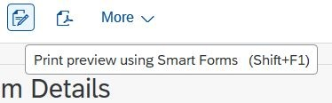
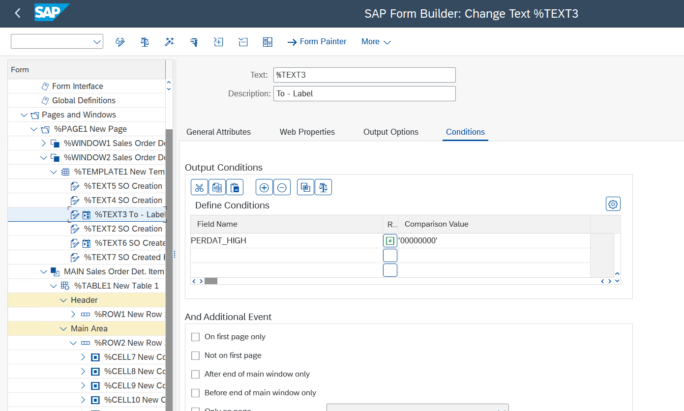

# Sales Order Report Project

This ABAP project allows users to generate Smartforms and PDF forms directly from an ALV Grid, using selected table entries. The user interacts with a custom selection screen and receives formatted outputs based on their input.

The main program in this project is:  
`zprs_sales_report_l.prog.abap`

## 📊 Data Sources and Field Mapping

This project uses **three main SAP tables** to display enriched sales order data:

### 1. `VBAK` – Sales Document: Header Data

| Field  | Description             |
|--------|-------------------------|
| VBELN  | Sales Document Number   |
| ERDAT  | Created On (Date)       |
| ERNAM  | Created By (Username)   |
| AUDAT  | Document Date           |

### 2. `VBAP` – Sales Document: Item Data

| Field  | Description             |
|--------|-------------------------|
| VBELN  | Sales Document Number   |
| POSNR  | Item Number             |
| MATNR  | Material Number         |
| ARKTX  | Short Text (Material)   |
| NETWR  | Net Value               |
| WAERK  | Currency                |

### 3. `MAKT` – Material Descriptions

| Field  | Description              |
|--------|--------------------------|
| MATNR  | Material Number (key)    |
| MAKTX  | Material Description     |
| SPRAS  | Language Key             |

---

## 🔗 Primary and Foreign Key Relationships

- `VBELN` (Sales Document Number) is the **primary key** in `VBAK` and a **foreign key** in `VBAP`. It joins sales header and item data.
- `MATNR` (Material Number) is the link between `VBAP` and `MAKT` to retrieve the material description (`MAKTX`).
- We fetch MAKTX from MAKT where MAKT-MATNR = VBAP-MATNR and a specific language (e.g., SPRAS = 'EN') is used.

## 🔍 Selection Criteria Screen

The user begins by filling out the **selection screen**, where **creation date (from)** is mandatory, and **creation date (to)** and **user name** are optional.


## 📊 Search Results in ALV Grid

After entering the criteria and executing the program, the results are fetched and displayed in an **ALV Grid**.

The ALV includes a checkbox column for selecting specific rows. The top-of-page content is also shown.


## 🖨️ Smartform Output

Clicking the Smartforms button generates a Smartform for the fetched entries.

- When **end date and user name are filled**, they appear in the Smartform.
- All entries or only selected ones (via checkboxes) can be included.

### Smartforms Button



### Smartform Output (All Entries, Full Info)


### Smartform Output (Selected Entries Only)

After selecting specific table entries:


Only those selected entries are included:


## 📄 PDF Forms Output

The PDF Forms button generates a PDF document similarly:

### PDF Forms Button


### PDF Output (All Entries, Full Info)


### PDF Output (Selected Entries Only)


## 🕵️‍♂️ Behavior When End Date and User Name Are Not Filled

If the user does not provide an end date or user name in the selection screen:


The results are still shown in the ALV:


The output forms will **not show** the "To" (end date) and "Created By" (user name) fields.

### Smartform Output Without End Date/User


### PDF Output Without End Date/User


## ⚙️ Conditional Display Logic

To dynamically hide/show the "To" date and "User" fields:

### In Smartforms

```abap
perdat_high <> 0
```

Only show fields when the end date is filled.



### In PDF Forms

JavaScript is used:

```javascript
if (end_date == "") {
  this.presence = "hidden";
} else {
  this.presence = "visible";
}
```


## 📁 Project Structure

```text
Sales-Order-Report/
├── images/         # Folder containing JPG and PNG screenshots of the project
├── src/            # Contains ABAP source code (classes, reports, includes)
├── .abapgit.xml    # abapGit metadata file
└── README.md       # Project documentation


